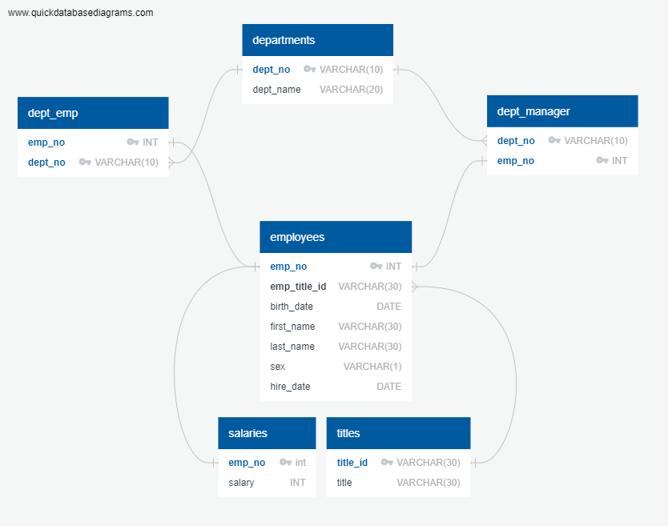

# Employee SQL - Employee Database

A research project of corporate employees utilizing several csv files to perform data modeling, engineering and analysis.

### Data Modeling & Engineering

All 6 CSVs were reviewed and then used to sketch out an ERD of the tables. Data types, primary keys, and foreign keys were identified. 

CSV files were then imported into the corresponding SQL tables

### Data Analysis
The following information was found and extracted

*List the following details of each employee: employee number, last name, first name, sex, and salary.
*List first name, last name, and hire date for employees who were hired in 1986.
*List the manager of each department with the following information: department number, department name, the manager's employee number, last name, first name.
*List the department of each employee with the following information: employee number, last name, first name, and department name.
*List first name, last name, and sex for employees whose first name is "Hercules" and last names begin with "B."
*List all employees in the Sales department, including their employee number, last name, first name, and department name.
*List all employees in the Sales and Development departments, including their employee number, last name, first name, and department name.
*In descending order, list the frequency count of employee last names, i.e., how many employees share each last name.

### Finally a visualization of the data was generated
SQL databases were imported into Pandas to check the dataset 

*Histogram to visualize most common salary ranges for employees

*Bar chart of average salary by employee title

